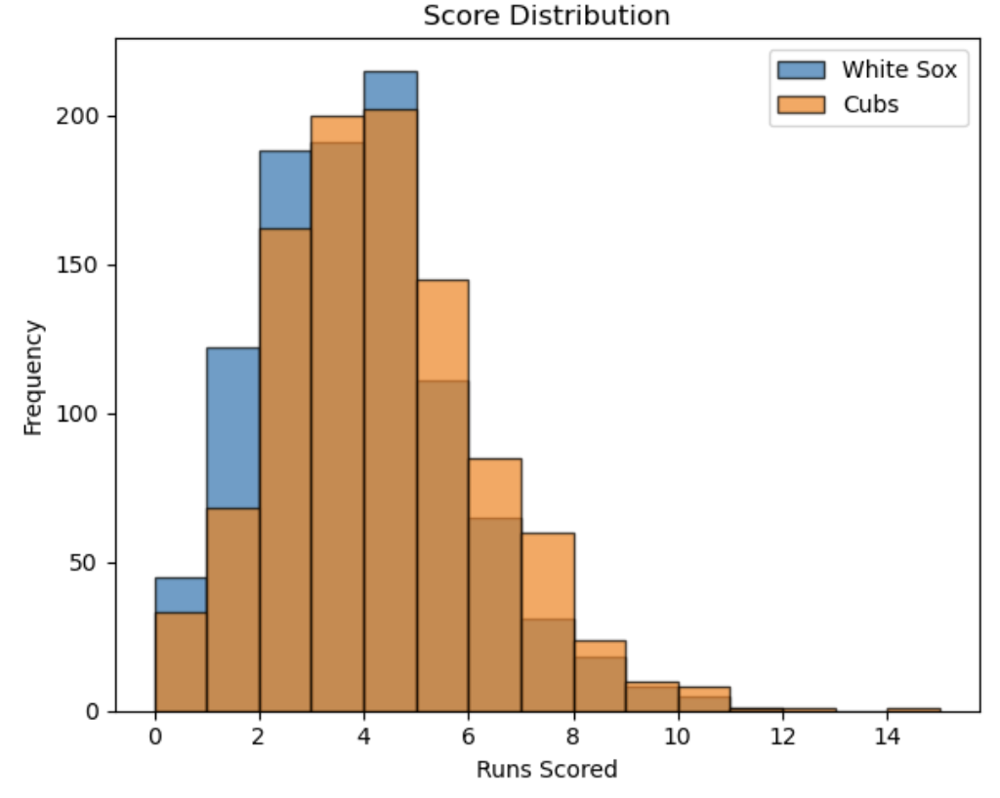
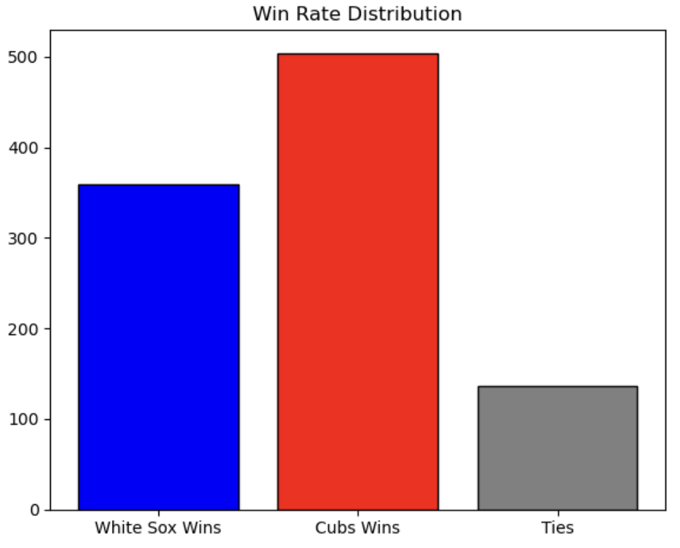

# ⚾ MSDS460 Final Project – Simulating MLB Games with Real Player Stats  
**A Monte Carlo Simulation of White Sox vs. Cubs Based on 2023 Season Performance**

**Authors**: Chenyi Zhao, Zixuan Zhang, Yahui Qian, Daisy Feng, Generative AI  
**Course**: MSDS 460 | Instructor: William (Bill) T. Mickelson, PhD  
**Dataset Source**: [pybaseball](https://github.com/jldbc/pybaseball) - MLB 2023 Season Stats  

---

## 📋 Table of Contents

- [Executive Summary](#executive-summary)
- [Problem Statement](#problem-statement)
- [Research Objectives](#research-objectives)
- [Dataset](#dataset)
- [Features](#features)
- [Methodology](#methodology)
- [Results](#results)
- [Limitations](#limitations)
- [Future Improvements](#future-improvements)
- [How to Reproduce](#how-to-reproduce)
- [AI Assistance](#ai-assistance)
- [License](#license)

---

## Executive Summary

This project simulates baseball games between the **Chicago White Sox** and **Chicago Cubs** based on **2023 real player statistics** using Monte Carlo simulation. Our goal was to model batter-pitcher matchups and estimate win probabilities through realistic statistical sampling. We conducted 1,000 simulated games and analyzed resulting distributions of scores and win rates.

---

## Problem Statement

Can we model and simulate the outcome of professional baseball games using historical player-level stats, and use that to predict head-to-head outcomes between two teams?

---

## Research Objectives

- Simulate MLB games using actual player batting/pitching stats  
- Model realistic outcomes (HR, strikeouts, BBs, etc.) using probabilistic matchups  
- Estimate win rates and scoring behavior over 1,000 simulated games  
- Explore statistical distributions and visualize simulation results  

---

## Dataset

We used the [pybaseball](https://github.com/jldbc/pybaseball) package to extract the following datasets:

- **Team Schedule and Scores**  
- **Player Batting Stats** (`batting_stats(2023)`)  
- **Player Pitching Stats** (`pitching_stats(2023)`)

Teams used:  
- Chicago White Sox (`CHW`)  
- Chicago Cubs (`CHC`)  

> See [`prepared_data/DATA_DESCRIPTION.md`](prepared_data/DATA_DESCRIPTION.md) for data columns and download instructions.

---

## Features

We modeled each batter-pitcher matchup using the following features:

**Batter-Side**
- Batting Average (AVG)
- Home Run Rate (HR / AB)
- Walk Rate (BB / PA)
- Strikeout Rate (SO / PA)

**Pitcher-Side**
- Batting AVG allowed
- Walk Rate (BB / BF)
- Strikeout Rate (SO / BF)
- Hits allowed

---

## Methodology

- **Matchup Logic**: Each at-bat was simulated using weighted probabilities from batter and pitcher stats.  
- **Outcome Sampling**: We derived outcome likelihoods (`Hit`, `HR`, `BB`, `SO`, `Out`) and sampled accordingly.  
- **Inning Logic**: Standard 9-inning structure, 3 outs per half-inning.  
- **Extra Innings**: If tied after 9 innings, sudden death extra innings simulated.  
- **Simulation Count**: 1,000 games

> All code is located in [`functional_code/codes.ipynb`](functional_code/codes.ipynb)

---

## Results

### Score Distribution  


### Win Rate Distribution  


### Player Stats Distribution  
- [Batting AVG Distribution](results/avg_distribution.png)  
- [Pitching IP Distribution](results/ip_distribution.png)

**Simulation Result Summary (1000 games)**  
- White Sox Win Rate: 35.9%  
- Cubs Win Rate: 50.4%  
- Tie Rate: 13.7%

> For detailed metrics and visuals, see [`results/Simulation_Results.md`](results/Simulation_Results.md)

---

## Limitations

- Sample size of batters/pitchers was small for demo purposes  
- No base-running, defense, or bullpen modeling  
- All matchups are treated independently (no fatigue, strategy, etc.)  
- Assumes stats are stationary over time

---

## Future Improvements

- Expand player pool to full roster  
- Add base-runner modeling and in-game strategy logic  
- Use time-dependent stats or rolling averages  
- Add team-specific fatigue and bullpen management logic

---

## How to Reproduce

1. Install dependencies:

```bash
pip install pybaseball pandas matplotlib seaborn numpy
````

2. Run the notebook:

```bash
jupyter notebook functional_code/codes.ipynb
```

All figures will be saved in the `results/` folder.

---

## AI Assistance

We used AI tools (e.g., ChatGPT) to assist in the following areas:

- Debugging Python code and resolving logic issues
- Designing and refining the simulation structure
- Writing documentation and project management artifacts (e.g., Work Breakdown Structure, Status Log, Functional Specs)

All AI-assisted contributions were reviewed and validated by our team to ensure correctness and clarity.

---

## License

This project is licensed under the MIT License. See [`LICENSE`](LICENSE) for details.

---
