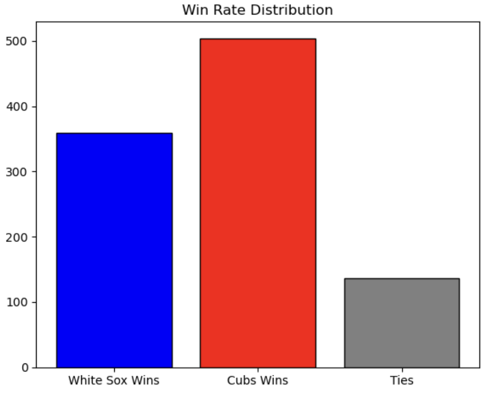
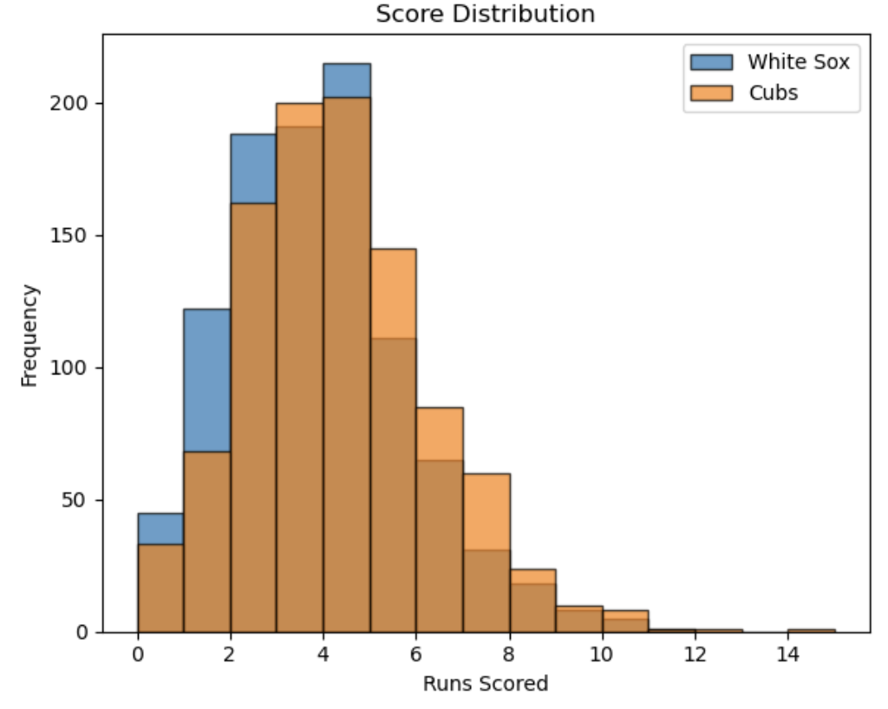

# Simulation Results Overview

This folder contains the output of our simulation model comparing the 2023 performance of the **Chicago White Sox** and **Chicago Cubs**, based on player-level statistics.

We used real-world batting and pitching data obtained from the [pybaseball](https://github.com/jldbc/pybaseball) library and simulated 1,000 games between the two teams using probabilistic player matchups.

---

## Summary Results (1000 Simulated Games)

- **White Sox Win Rate**: 35.90%  
- **Cubs Win Rate**: 50.40%  
- **Tie Rate**: 13.70%

The Cubs won more than half the games simulated, while the White Sox had a lower win rate. Ties occurred in about 14% of games, indicating a non-negligible level of parity.

> Player Pool Used:  
> - Batters: 4 from White Sox, 5 from Cubs  
> - Pitchers: 1 from each team

---

## Visualizations

### 1. Win Rate Distribution

This bar chart compares the number of simulations won by each team:



---

### 2. Score Distribution

This histogram shows how many runs each team scored across the simulations:



---

### 3. Innings Pitched (IP) Distribution

This chart shows the distribution of total innings pitched among selected pitchers:


---

### 4. Batting Average (AVG) Distribution

This chart visualizes the batting average distributions for both teams:


---

## How to Reproduce the Results

All results were generated using the code in:

```

functional\_code/codes.ipynb

````

To rerun the simulation:

1. **Install dependencies**:

```bash
pip install pybaseball pandas matplotlib seaborn numpy
````

2. **Run the notebook in a Jupyter environment**. The notebook will:

   * Pull 2023 White Sox and Cubs data via `pybaseball`
   * Simulate 1,000 games
   * Generate and save all result plots using `plt.savefig()` automatically into the `results/` folder
